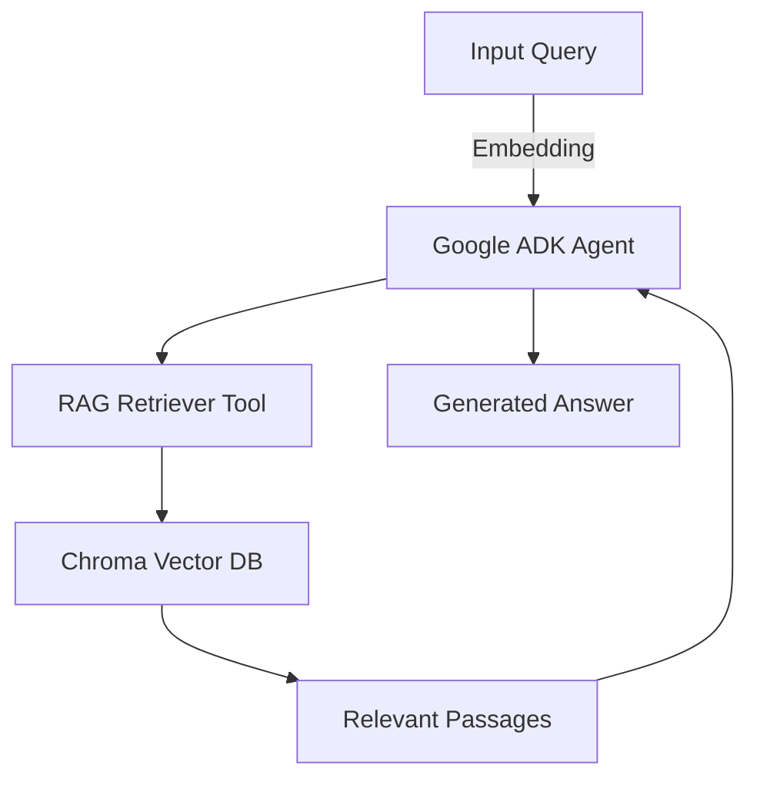

# **Fragments on Machines RAG Explorer**

A labor of love and a piece of art, this project brings Karl Marx’s seminal text *The Fragments on Machines* into the digital age by embedding its philosophical and economic insights within a state-of-the-art retrieval-augmented generation (RAG) system. Combining classical political economy with modern AI, this repository serves as both a scholarly archive and an interactive tool for critical reflection on automation, labor, and value.

---

## 🧠 Project Overview

This project performs semantic embedding and vectorized storage of *The Fragments on Machines*—a prophetic excerpt from Karl Marx’s *Grundrisse* , written back in 1857 —into a [ChromaDB](https://www.trychroma.com/) vector database. It leverages a Retrieval-Augmented Generation (RAG) pipeline to enable intelligent querying and dialogue over the text.

A custom-built visualization engine complements the system, allowing users to trace the logic of RAG-based document retrieval, with future extensions planned for interactive query path tracing and conceptual lineage tracking.

---

## ✨ Features

- **Semantic Embedding** of *The Fragments on Machines* into a ChromaDB vector database using modern language models.
- **RAG Pipeline** that retrieves context-aware document chunks to answer user queries.
- **Google ADK Agent** integration that interfaces with the RAG tool for intelligent responses.
- **Visual Trace Map** for introspecting the flow and structure of document retrieval (prototype stage).
- **Open-ended Exploration** of philosophical and economic themes such as automation, surplus labor, and machinic abstraction.

---

## 🏗️ Architecture



---

## 🧰 Tech Stack

- **Python 3.10+**
- **ChromaDB** – vector database for document storage and retrieval
- **Custom RAG Logic** – pipeline for question answering
- **Google ADK Agent** – agentic interface for interacting with the corpus
- **Plotly express** – for visualization and query path tracing
- **Google embedding-001** – for text embedding

---

## 📚 Background: Why *The Fragments on Machines*?

> "*once adopted into the production process of capital, the means of labour passes through different metamorphoses, whose culmination is the machine, or rather, an automatic system of machinery (system of machinery: the automatic one is merely its most complete, most adequate form, and alone transforms machinery into a system), set in motion by an automaton, a moving power that moves itself; this automaton consisting of numerous mechanical and intellectual organs, so that the workers themselves are cast merely as its conscious linkages. In the machine, and even more in machinery as an automatic system, the use value, i.e. the material...*"  
> – Karl Marx, *The Fragment on Machines*

Marx foresaw the implications of automation long before the digital age. This project embodies his intellectual legacy by placing his insights into dialogue with modern AI systems, enabling new interpretations and critical conversations around labor, capital, and machine intelligence.

---

## 🚀 Getting Started

### Prerequisites

- Python 3.10+
- Virtual environment (recommended)
- [ChromaDB](https://docs.trychroma.com/) installed and running
- OpenAI API key (or other embedding provider)

### Installation

```bash
git clone https://github.com/BlueHat1993/Vector.git
cd Vector
pip install -r requirements.txt
```

### Usage

1. **Embed the Text**:
   ```bash
   python vector.py
   ```

2. **Run the Chroma DB**:
   ```bash
   chroma run --path chroma_db --port <port_number>
   ```

3. **Visualize Embeddings**:
   ```bash
   python visualization.py
   ```
4. **Run the RAG Agent**
    ```bash
     adk web
   ```
---

## 🖼️ Visualization

An early visualization module allows you to trace embeddings of each chunks in a 3D vector space. Future iterations will support graph-based semantic maps, keyword trails, and inter-concept relationships from the embedded text.

---

## 🎨 Philosophy Meets Code

This repository is more than a technical implementation—it's a tribute to the intersection of historical materialism and machine learning. It is a call to reclaim critical theory within the algorithmic paradigm.

---

## 🤝 Contributing

Contributions, suggestions, and critiques—both technical and philosophical—are welcome. Please open an issue or submit a pull request.

---

## 📜 License

This project is licensed under the MIT License. See the `LICENSE` file for details.

---

## ✍️ Acknowledgements

- Karl Marx for his enduring insight.
- The open-source AI and NLP communities.
- All thinkers striving to reclaim critical discourse in a world of accelerating automation.

---
